# 🔄 Software Development Life Cycle (SDLC) Phases

## Overview

This comprehensive SDLC framework provides a structured approach to software development, encompassing five key phases from ideation through implementation. Each phase is designed to ensure quality, manage risks, and deliver successful software solutions.

## 🚀 SDLC Phases Overview

```mermaid
graph TD
    A[💡 Ideation Phase] --> B[📋 Requirements Phase]
    B --> C[🏗️ Architecture Phase]
    C --> D[🎨 Design Phase]
    D --> E[⚙️ Implementation Phase]
    
    style A fill:#e1f5fe
    style B fill:#f3e5f5
    style C fill:#e8f5e8
    style D fill:#fff3e0
    style E fill:#fce4ec
```

## 📋 Phase Summary

### 1. 💡 Ideation Phase
**Duration**: 2-4 weeks  
**Focus**: Innovation, validation, and business case development  

**Key Objectives**:
- Generate and evaluate innovative ideas
- Conduct market research and feasibility analysis
- Validate concepts with stakeholders
- Develop business cases and secure funding

**Primary Deliverables**:
- Idea Log and Market Analysis Report
- Feasibility Study and Business Case
- Concept Document and Stakeholder Summary

**Success Criteria**:
- Validated concept with market demand
- Approved business case and allocated resources
- Stakeholder buy-in and phase gate approval

### 2. 📋 Requirements Phase
**Duration**: 3-6 weeks  
**Focus**: Comprehensive requirement capture and analysis  

**Key Objectives**:
- Elicit and analyze stakeholder requirements
- Document functional and non-functional requirements
- Create requirements traceability matrix
- Validate requirements with stakeholders

**Primary Deliverables**:
- Business Requirements Document (BRD)
- Software Requirements Specification (SRS)
- User Stories and Acceptance Criteria
- Requirements Traceability Matrix

**Success Criteria**:
- Complete and validated requirements documentation
- Established traceability matrix
- Test cases developed for all requirements
- Stakeholder approval and baseline establishment

### 3. 🏗️ Architecture Phase
**Duration**: 4-6 weeks  
**Focus**: System architecture design and technology selection  

**Key Objectives**:
- Design high-level system architecture
- Select appropriate technology stack
- Define component architecture and interfaces
- Address non-functional requirements

**Primary Deliverables**:
- System Architecture Document
- Architecture Decision Records (ADRs)
- Technology Stack Specification
- Component Architecture Diagrams

**Success Criteria**:
- Complete architecture specification
- Technology stack evaluation and selection
- Architecture peer review and approval
- Performance and security validation

### 4. 🎨 Design Phase
**Duration**: 3-5 weeks  
**Focus**: Detailed technical design and specification  

**Key Objectives**:
- Create detailed component designs
- Design user interfaces and user experiences
- Develop database schemas and API specifications
- Implement security and performance design controls

**Primary Deliverables**:
- Component Design Specifications
- Database Design Documents
- API Specifications
- UI/UX Design Assets

**Success Criteria**:
- Complete design specifications
- Approved database and API designs
- UI/UX design validation
- Security and performance design review

### 5. ⚙️ Implementation Phase
**Duration**: 8-16 weeks (varies by project complexity)  
**Focus**: Code development, testing, and quality assurance  

**Key Objectives**:
- Implement all designed features and components
- Develop comprehensive test suites
- Ensure code quality and security standards
- Prepare system for deployment

**Primary Deliverables**:
- Source Code and Unit Test Suite
- Integration Tests and Code Documentation
- Test Reports and Performance Metrics
- Security Scan Results

**Success Criteria**:
- All features implemented and tested
- Code quality gates passed
- Security scans clear
- Performance benchmarks met

## 🔄 Phase Transitions

### Phase Gate Criteria
Each phase includes specific exit criteria that must be met before proceeding to the next phase:

1. **Formal Review**: All deliverables reviewed and approved
2. **Quality Assurance**: Quality metrics meet defined standards
3. **Stakeholder Approval**: Key stakeholders provide formal approval
4. **Documentation Complete**: All required documentation is complete
5. **Risk Assessment**: Risks identified and mitigation plans in place

### Feedback Loops
The SDLC framework incorporates feedback mechanisms:

- **Iterative Refinement**: Return to previous phases when necessary
- **Continuous Improvement**: Process improvements based on lessons learned
- **Stakeholder Feedback**: Ongoing stakeholder engagement throughout
- **Quality Gates**: Quality checks at each phase transition

## 🎯 Key Benefits

### 1. Structured Approach
- **Clear Process**: Well-defined phases and activities
- **Consistency**: Standardized processes across projects
- **Predictability**: Reliable timelines and deliverables
- **Accountability**: Clear ownership and responsibilities

### 2. Quality Assurance
- **Quality Gates**: Quality checks at each phase
- **Comprehensive Testing**: Multiple layers of testing
- **Code Quality**: High coding standards and reviews
- **Security Focus**: Built-in security considerations

### 3. Risk Management
- **Early Risk Identification**: Risks identified early in process
- **Mitigation Strategies**: Proactive risk mitigation
- **Contingency Planning**: Backup plans for critical risks
- **Regular Assessment**: Ongoing risk monitoring

### 4. Stakeholder Alignment
- **Early Engagement**: Stakeholders involved from the beginning
- **Clear Communication**: Regular updates and reviews
- **Validation**: Continuous validation with stakeholders
- **Transparency**: Visible progress and decision-making

## 🔍 AI Enhancement Across Phases

### AI-Powered Tools
- **Requirements Analysis**: Automated requirement quality analysis
- **Architecture Design**: AI-driven architecture pattern recognition
- **Design Validation**: Automated design quality checks
- **Code Quality**: AI-powered code review and analysis
- **Testing Automation**: AI-generated test cases and analysis

### AI Workflows
Each phase includes AI-enhanced workflows that:
- Automate repetitive tasks
- Provide intelligent recommendations
- Enhance quality and consistency
- Reduce manual effort and errors

## 📊 Metrics and KPIs

### Project Metrics
- **Schedule Performance**: Timeline adherence
- **Budget Performance**: Cost management
- **Quality Metrics**: Defect density, test coverage
- **Stakeholder Satisfaction**: Stakeholder feedback scores

### Process Metrics
- **Phase Duration**: Time spent in each phase
- **Rework Rate**: Amount of work requiring revision
- **Approval Time**: Time for phase gate approvals
- **Defect Detection**: Defects found vs. escaped

### Quality Metrics
- **Code Quality**: Static analysis scores
- **Test Coverage**: Percentage of code covered
- **Security Score**: Security assessment results
- **Performance Metrics**: Response time, throughput

## 🚀 Continuous Improvement

### Process Improvement
- **Retrospectives**: Regular process review meetings
- **Lessons Learned**: Documentation of lessons learned
- **Process Updates**: Regular process refinement
- **Best Practices**: Sharing of best practices across projects

### Framework Evolution
- **Technology Updates**: Incorporate new technologies and tools
- **Methodology Updates**: Adopt new development methodologies
- **Standards Updates**: Update standards and guidelines
- **Training and Development**: Team training and skill development

## 📚 Additional Resources

### Phase-Specific Resources
- [Ideation Phase Details](ideation/README.md)
- [Requirements Phase Details](requirements/README.md)
- [Architecture Phase Details](architecture/README.md)
- [Design Phase Details](design/README.md)
- [Implementation Phase Details](implementation/README.md)

### Guidelines and Best Practices
- [Design Guidelines](../guidelines/design.md)
- [Coding Standards](../guidelines/coding-standards.md)
- [Testing Best Practices](../guidelines/testing.md)
- [Security Guidelines](../guidelines/security.md)
- [Performance Optimization](../guidelines/performance.md)

### Templates and Tools
- [Phase Templates](../templates/)
- [Checklists](../checklists/)
- [AI Tools Configuration](../ai-tools/)
- [CI/CD Pipelines](../ci-cd/)

---

*Generated by AI SDLC Framework on 2025-12-18T17:55:00.000Z*
