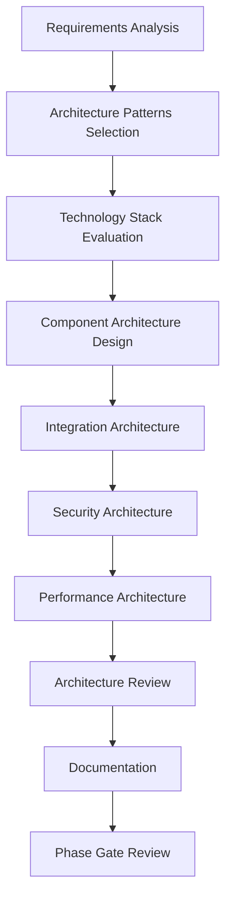

# 🏗️ Architecture Phase

## Overview

The Architecture Phase translates requirements into a structured technical blueprint that defines the system's structure, components, interactions, and constraints. This phase establishes the foundation for scalable, maintainable, and robust software solutions.

## 🎯 Objectives

- **System Architecture Design**: Create high-level system architecture
- **Technology Selection**: Choose appropriate technologies and frameworks
- **Component Design**: Define system components and their relationships
- **Integration Strategy**: Plan system integrations and interfaces
- **Non-Functional Requirements**: Address performance, security, scalability

## 🔄 Process Flow



## 📋 Key Activities

### 1. Architecture Analysis
- **Requirements Translation**: Convert requirements to architecture decisions
- **Constraints Analysis**: Identify technical and business constraints
- **Risk Assessment**: Architectural risk identification and mitigation
- **Trade-off Analysis**: Evaluate competing architectural approaches
- **Compliance Requirements**: Ensure regulatory compliance

### 2. Architecture Design
- **Architectural Patterns**: Select appropriate design patterns
- **Component Architecture**: Define system components and boundaries
- **Data Architecture**: Design data models and storage strategies
- **Integration Architecture**: Plan system integrations and APIs
- **Security Architecture**: Design security layers and controls

### 3. Technology Evaluation
- **Technology Stack Selection**: Choose programming languages, frameworks
- **Infrastructure Planning**: Define deployment architecture
- **Third-party Evaluation**: Assess external dependencies
- **Performance Planning**: Design for performance requirements
- **Scalability Design**: Plan for growth and load scaling

### 4. Architecture Documentation
- **Architecture Decision Records (ADRs)**: Document key decisions
- **System Architecture Diagrams**: Visual representation of architecture
- **Component Specifications**: Detailed component documentation
- **Interface Specifications**: API and interface documentation
- **Deployment Architecture**: Infrastructure and deployment design

## 📊 Deliverables

| Deliverable | Description | Format |
|-------------|-------------|--------|
| **System Architecture Document** | Complete architecture specification | PDF/Markdown |
| **Architecture Decision Records (ADRs)** | Key architectural decisions | Markdown |
| **Component Architecture Diagrams** | Visual component relationships | Drawio/Diagrams |
| **Technology Stack Specification** | Chosen technologies and rationale | Markdown |
| **Integration Architecture** | System integration design | PDF/Markdown |
| **Security Architecture** | Security design and controls | PDF/Markdown |
| **Performance Architecture** | Performance design and benchmarks | PDF/Markdown |

## 🏗️ Architecture Views

### 1. Business Architecture
- **Business Process Mapping**: How architecture supports business processes
- **Organizational Structure**: How architecture aligns with organization
- **Business Rules**: Implementation of business rules in architecture
- **Stakeholder Requirements**: Alignment with stakeholder needs

### 2. Application Architecture
- **Component Architecture**: System components and their interactions
- **Service Architecture**: Service design and interactions
- **Data Architecture**: Data models and data flow
- **Integration Architecture**: System integrations and APIs

### 3. Technology Architecture
- **Technology Stack**: Programming languages, frameworks, tools
- **Infrastructure Architecture**: Hardware, networking, cloud resources
- **Deployment Architecture**: Deployment models and environments
- **Operations Architecture**: Monitoring, logging, maintenance

### 4. Security Architecture
- **Authentication & Authorization**: User identity and access control
- **Data Protection**: Encryption, masking, privacy controls
- **Network Security**: Firewalls, DMZs, network segmentation
- **Application Security**: Secure coding practices and controls

## 🔍 AI Enhancement

### AI-Powered Architecture Tools
- **Architecture Pattern Recognition**: AI-driven pattern matching
- **Technology Recommendation**: AI-powered technology selection
- **Performance Prediction**: AI-based performance modeling
- **Security Vulnerability Analysis**: Automated security assessment

### AI Workflows
```yaml
# AI Architecture Review Workflow
name: AI Architecture Review
on:
  pull_request:
    paths:
      - 'docs/architecture/**'
      - 'src/**'

jobs:
  architecture-review:
    runs-on: ubuntu-latest
    steps:
      - name: Analyze Architecture Patterns
        uses: ai/architecture-analyzer@v1
        with:
          architecture-path: 'docs/architecture/'
          
      - name: Validate Technology Choices
        uses: ai/technology-validator@v1
        
      - name: Performance Modeling
        uses: ai/performance-modeler@v1
        
      - name: Security Architecture Review
        uses: ai/security-architect@v1
        
      - name: Generate Architecture Diagrams
        uses: ai/diagram-generator@v1
```

## 🏗️ Architectural Patterns

### 1. Monolithic Architecture
- **Description**: Single deployable unit with all functionality
- **Use Cases**: Small applications, simple business logic
- **Pros**: Simple deployment, easy debugging
- **Cons**: Scalability issues, tight coupling

### 2. Microservices Architecture
- **Description**: Distributed services with specific business functions
- **Use Cases**: Complex applications, scalable systems
- **Pros**: Independent scaling, technology diversity
- **Cons**: Complexity, network overhead

### 3. Event-Driven Architecture
- **Description**: Asynchronous communication through events
- **Use Cases**: Real-time systems, loosely coupled components
- **Pros**: Scalability, flexibility
- **Cons**: Debugging complexity, eventual consistency

### 4. Serverless Architecture
- **Description**: Function-based execution without server management
- **Use Cases**: Event-driven workloads, sporadic usage
- **Pros**: Cost efficiency, automatic scaling
- **Cons**: Vendor lock-in, execution limits

## 📝 Templates

### Architecture Decision Record (ADR) Template
```markdown
# ADR-XXX: [Title]

## Status
[Proposed/Accepted/Deprecated/Superseded]

## Context
[What is the situation that led to this decision?]

## Decision
[What is the change that we're actually proposing or making?]

## Consequences
[What becomes easier or more difficult to do because of this change?]

## Alternatives Considered
- [Alternative 1]: [Why it was rejected]
- [Alternative 2]: [Why it was rejected]

## Implementation Notes
[How will this decision be implemented?]

## Related Decisions
[Links to related ADRs]
```

### Component Specification Template
```markdown
# Component: [Name]

## Description
[Brief description of the component's purpose]

## Responsibilities
- [Responsibility 1]
- [Responsibility 2]
- [Responsibility 3]

## Interfaces
### Public APIs
- [API 1]: [Description]
- [API 2]: [Description]

### Dependencies
- [Dependency 1]: [Purpose]
- [Dependency 2]: [Purpose]

## Technology Stack
- [Language/Framework]: [Version]
- [Database]: [Type and Version]
- [Libraries]: [Key dependencies]

## Non-Functional Requirements
- **Performance**: [Performance requirements]
- **Security**: [Security requirements]
- **Scalability**: [Scalability requirements]
- **Reliability**: [Reliability requirements]

## Data Models
[Description of data structures and schemas]

## Deployment
[Deployment considerations and requirements]
```

## 🎯 Architecture Quality Attributes

### 1. Performance
- **Response Time**: Time to respond to requests
- **Throughput**: Number of requests per unit time
- **Resource Utilization**: Efficient use of CPU, memory, storage
- **Scalability**: Ability to handle increased load

### 2. Security
- **Authentication**: Verify user identity
- **Authorization**: Control access to resources
- **Data Protection**: Encrypt sensitive data
- **Audit Trail**: Track security events

### 3. Reliability
- **Availability**: System uptime and accessibility
- **Fault Tolerance**: Handle failures gracefully
- **Recovery**: Recover from failures
- **Data Integrity**: Ensure data consistency

### 4. Maintainability
- **Modularity**: Well-defined component boundaries
- **Testability**: Easy to test components
- **Readability**: Clear and understandable code
- **Documentation**: Comprehensive documentation

## 🚀 Phase Exit Criteria

The Architecture Phase is complete when:

1. ✅ **Architecture Documented**: Complete architecture specification exists
2. ✅ **Technology Stack Selected**: Technologies are evaluated and chosen
3. ✅ **Architecture Reviewed**: Architecture has been peer-reviewed
4. ✅ **ADRs Created**: Key architectural decisions are documented
5. ✅ **Performance Validated**: Architecture meets performance requirements
6. ✅ **Security Approved**: Security architecture is approved
7. ✅ **Phase Gate Passed**: Formal approval from governance committee

## 📚 Related Resources

- [Design Phase](../design/README.md)
- [Implementation Phase](../implementation/README.md)
- [Architecture Patterns Guide](../guidelines/architecture-patterns.md)
- [Technology Evaluation Framework](../guidelines/technology-evaluation.md)

---

*Generated by AI SDLC Framework on 2025-12-18T17:52:00.000Z*
