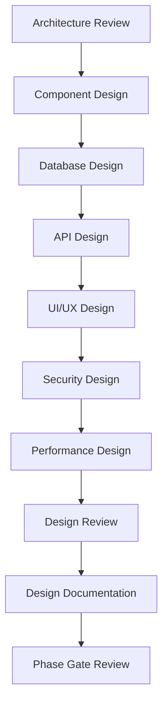

# 🎨 Design Phase

## Overview

The Design Phase translates architectural specifications into detailed technical designs that guide implementation. This phase focuses on creating detailed component designs, user interface designs, database schemas, and technical specifications that developers can implement directly.

## 🎯 Objectives

- **Detailed Component Design**: Create comprehensive component specifications
- **User Interface Design**: Design user experiences and interfaces
- **Database Design**: Design data models and database schemas
- **API Design**: Design application programming interfaces
- **Security Design**: Implement security controls at design level

## 🔄 Process Flow



## 📋 Key Activities

### 1. Component Design
- **Class Design**: Define classes, methods, and relationships
- **Module Design**: Design modular components and interfaces
- **Algorithm Design**: Design algorithms and data structures
- **Design Patterns**: Apply appropriate design patterns
- **Component Interfaces**: Define component contracts and APIs

### 2. Database Design
- **Conceptual Design**: High-level data model
- **Logical Design**: Detailed entity-relationship model
- **Physical Design**: Database schema and optimization
- **Data Migration**: Design data migration strategies
- **Data Security**: Design data access controls

### 3. API Design
- **RESTful APIs**: Design REST API endpoints
- **GraphQL Schemas**: Design GraphQL schemas if applicable
- **API Documentation**: Create comprehensive API docs
- **Authentication**: Design API security mechanisms
- **Rate Limiting**: Design API usage controls

### 4. User Interface Design
- **Wireframes**: Create low-fidelity screen designs
- **Mockups**: Design high-fidelity user interfaces
- **Prototypes**: Create interactive UI prototypes
- **Design System**: Establish UI component library
- **Accessibility**: Design for accessibility standards

### 5. Security Design
- **Authentication Design**: Design user authentication flows
- **Authorization Design**: Design access control mechanisms
- **Data Encryption**: Design data protection strategies
- **Security Controls**: Implement security design patterns
- **Compliance**: Ensure regulatory compliance in design

## 📊 Deliverables

| Deliverable | Description | Format |
|-------------|-------------|--------|
| **Component Design Specifications** | Detailed component designs | PDF/Markdown |
| **Database Design Documents** | Database schemas and models | Drawio/Diagrams |
| **API Specifications** | Complete API documentation | OpenAPI/Swagger |
| **UI/UX Design Assets** | Wireframes, mockups, prototypes | Figma/Sketch |
| **Security Design Document** | Security controls and mechanisms | PDF/Markdown |
| **Performance Design** | Performance optimization strategies | PDF/Markdown |
| **Design Review Reports** | Peer review outcomes | Markdown |

## 🎨 Design Categories

### 1. Component Design
- **Class Diagrams**: Visual representation of classes and relationships
- **Sequence Diagrams**: Interaction flows between components
- **State Diagrams**: Component state transitions
- **Package Diagrams**: Component organization and dependencies
- **Component Diagrams**: High-level component structure

### 2. Data Design
- **Entity-Relationship Diagrams**: Data model visualization
- **Database Schemas**: Detailed table structures
- **Data Flow Diagrams**: Data movement through system
- **Data Dictionary**: Complete data element definitions
- **Data Migration Plans**: Strategies for data transitions

### 3. Interface Design
- **API Contracts**: Detailed API specifications
- **Message Formats**: Data exchange formats
- **Error Handling**: Error response designs
- **Versioning Strategy**: API version management
- **Documentation**: Comprehensive API documentation

### 4. User Interface Design
- **User Flow Diagrams**: User journey maps
- **Wireframes**: Low-fidelity screen layouts
- **Mockups**: High-fidelity visual designs
- **Style Guides**: Design standards and guidelines
- **Interactive Prototypes**: Clickable UI demonstrations

## 🔍 AI Enhancement

### AI-Powered Design Tools
- **Design Pattern Recognition**: AI-driven pattern recommendations
- **UI/UX Analysis**: Automated usability analysis
- **Database Optimization**: AI-powered database design suggestions
- **API Design Validation**: Automated API design checks
- **Security Design Analysis**: AI security vulnerability detection

### AI Workflows
```yaml
# AI Design Review Workflow
name: AI Design Review
on:
  pull_request:
    paths:
      - 'docs/design/**'
      - 'src/**'

jobs:
  design-review:
    runs-on: ubuntu-latest
    steps:
      - name: Analyze Design Patterns
        uses: ai/design-pattern-analyzer@v1
        with:
          design-path: 'docs/design/'
          
      - name: Validate API Design
        uses: ai/api-design-validator@v1
        
      - name: Database Design Review
        uses: ai/database-design-reviewer@v1
        
      - name: UI/UX Analysis
        uses: ai/ux-analyzer@v1
        
      - name: Security Design Check
        uses: ai/security-design-checker@v1
```

## 🎨 Design Patterns

### 1. Creational Patterns
- **Singleton**: Ensure a class has only one instance
- **Factory Method**: Create objects without specifying exact classes
- **Abstract Factory**: Create families of related objects
- **Builder**: Construct complex objects step by step
- **Prototype**: Create new objects by copying existing ones

### 2. Structural Patterns
- **Adapter**: Convert interface of a class to another interface
- **Decorator**: Add new functionality to objects dynamically
- **Facade**: Provide simplified interface to complex system
- **Proxy**: Provide surrogate or placeholder for another object
- **Composite**: Compose objects into tree structures

### 3. Behavioral Patterns
- **Observer**: Define one-to-many dependency between objects
- **Strategy**: Define family of algorithms, encapsulate each one
- **Command**: Encapsulate request as an object
- **State**: Allow object to alter behavior when internal state changes
- **Template Method**: Define skeleton of algorithm, let subclasses fill steps

## 📝 Templates

### Component Design Template
```markdown
# Component Design: [Component Name]

## Overview
[Brief description of the component's purpose and scope]

## Class Design
### Classes
- **[ClassName]**: [Purpose]
  - Properties:
    - [property]: [type] - [description]
  - Methods:
    - [method]: [return type] - [description]

### Relationships
- [ComponentA] → [ComponentB]: [Relationship type and description]

## Design Patterns Used
- **[Pattern Name]**: [Why and where it's used]

## Interfaces
### Public Interface
- [interface]: [description]

### Dependencies
- [dependency]: [purpose and usage]

## Algorithm Design
[Description of key algorithms and logic]

## Error Handling
[Error handling strategies and exception types]

## Performance Considerations
[Performance optimization strategies]

## Security Considerations
[Security controls and validations]

## Testing Strategy
[Unit testing approach and considerations]
```

### API Design Template
```markdown
# API Design: [API Name]

## Overview
[Description of the API's purpose and scope]

## Base URL
```
https://api.example.com/v1
```

## Authentication
[Authentication method and requirements]

## Endpoints

### [Endpoint Name]
**URL**: `HTTP_METHOD /path/to/endpoint`

**Description**: [What this endpoint does]

**Parameters**:
- [param_name]: [type] - [description] (required/optional)

**Request Body**:
```json
{
  "field": "type",
  "description": "description"
}
```

**Response**:
```json
{
  "field": "type",
  "description": "description"
}
```

**Status Codes**:
- `200`: Success
- `400`: Bad Request
- `401`: Unauthorized
- `500`: Internal Server Error

## Rate Limiting
[Rate limiting rules and policies]

## Error Response Format
[Standard error response structure]

## Versioning Strategy
[API versioning approach]
```

### Database Design Template
```markdown
# Database Design: [Database Name]

## Overview
[Description of the database's purpose and scope]

## Entity Relationship Diagram
[Diagram or description of relationships]

## Tables

### [Table Name]
**Description**: [Table purpose]

**Columns**:
| Column | Type | Constraints | Description |
|--------|------|-------------|-------------|
| id | INT | PRIMARY KEY | Unique identifier |
| name | VARCHAR(255) | NOT NULL | [Description] |

**Indexes**:
- [index_name]: [columns] - [purpose]

**Foreign Keys**:
- [fk_name]: [column] → [table].[column]

## Data Types and Constraints
[Data type standards and constraint rules]

## Optimization Strategies
[Indexing, partitioning, and other optimizations]

## Security Controls
[Access controls, encryption, and other security measures]

## Backup and Recovery
[Backup strategies and recovery procedures]
```

## 🎯 Design Quality Attributes

### 1. Maintainability
- **Modularity**: Well-defined component boundaries
- **Readability**: Clear and understandable code structure
- **Documentation**: Comprehensive design documentation
- **Consistency**: Adherence to design standards

### 2. Extensibility
- **Open/Closed Principle**: Open for extension, closed for modification
- **Plug-in Architecture**: Support for adding new functionality
- **Configuration**: Configurable behavior without code changes
- **Versioning**: Support for backward compatibility

### 3. Performance
- **Efficiency**: Optimal use of resources
- **Scalability**: Ability to handle increased load
- **Response Time**: Minimal response latency
- **Throughput**: Maximum processing capacity

### 4. Security
- **Authentication**: Verify user identity
- **Authorization**: Control access to resources
- **Data Protection**: Secure data handling
- **Input Validation**: Prevent injection attacks

## 🚀 Phase Exit Criteria

The Design Phase is complete when:

1. ✅ **Component Designs Complete**: All components are fully designed
2. ✅ **Database Design Approved**: Database schema is finalized
3. ✅ **API Specifications Ready**: All APIs are documented
4. ✅ **UI/UX Designs Approved**: User interface designs are accepted
5. ✅ **Security Design Reviewed**: Security controls are validated
6. ✅ **Performance Design Validated**: Performance strategies are confirmed
7. ✅ **Design Reviews Conducted**: Peer reviews are completed
8. ✅ **Phase Gate Passed**: Formal approval from governance committee

## 📚 Related Resources

- [Implementation Phase](../implementation/README.md)
- [Architecture Phase](../architecture/README.md)
- [Design Patterns Catalog](../guidelines/design-patterns.md)
- [UI/UX Best Practices](../guidelines/ui-ux-design.md)
- [API Design Guidelines](../guidelines/api-design.md)

---

*Generated by AI SDLC Framework on 2025-12-18T17:53:00.000Z*
