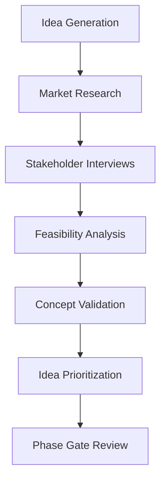

# 💡 Ideation Phase

## Overview

The Ideation Phase is the foundation of the Software Development Life Cycle where innovative ideas are conceived, evaluated, and transformed into actionable project concepts. This phase focuses on creativity, market research, and feasibility analysis.

## 🎯 Objectives

- **Brainstorming**: Generate innovative solutions and features
- **Market Analysis**: Identify market needs and opportunities
- **Feasibility Assessment**: Evaluate technical and business viability
- **Stakeholder Alignment**: Ensure consensus among key stakeholders
- **Concept Validation**: Test and refine initial ideas

## 🔄 Process Flow



## 📋 Key Activities

### 1. Idea Generation Workshops
- **Brainstorming Sessions**: Collaborative idea generation
- **Design Thinking**: User-centric problem identification
- **Competitive Analysis**: Market gap identification
- **Technology Trends**: Emerging technology evaluation

### 2. Market Research
- **Target Audience Analysis**: User persona development
- **Market Size Assessment**: Total Addressable Market (TAM)
- **Competitive Landscape**: SWOT analysis
- **Regulatory Considerations**: Compliance requirements

### 3. Stakeholder Engagement
- **User Interviews**: Direct user feedback collection
- **Business Stakeholder Workshops**: Alignment on business goals
- **Technical Feasibility**: Architecture team consultation
- **Financial Viability**: ROI analysis and budget planning

### 4. Concept Validation
- **Prototype Development**: Minimum Viable Product (MVP)
- **User Testing**: Feedback collection and iteration
- **Technical Proof of Concept**: Technical validation
- **Business Case Development**: Detailed proposal

## 📊 Deliverables

| Deliverable | Description | Format |
|-------------|-------------|--------|
| **Idea Log** | Comprehensive list of generated ideas | Markdown/Spreadsheet |
| **Market Analysis Report** | Market research findings | PDF/Markdown |
| **Stakeholder Summary** | Key insights and requirements | Markdown |
| **Feasibility Study** | Technical and business viability | PDF/Markdown |
| **Concept Document** | Detailed project concept | Markdown |
| **Business Case** | Financial justification | PDF/Presentation |

## 🎯 Success Criteria

- **Clear Problem Definition**: Well-articulated problem statement
- **Market Validation**: Confirmed market need and demand
- **Technical Feasibility**: Proven technical viability
- **Stakeholder Buy-in**: Formal approval from key stakeholders
- **Resource Allocation**: Approved budget and team assignment

## 🔍 AI Enhancement

### AI-Powered Tools
- **Market Analysis AI**: Automated market research and trend analysis
- **Idea Scoring Algorithm**: Objective idea evaluation framework
- **Competitive Intelligence**: Real-time competitor monitoring
- **User Sentiment Analysis**: Automated feedback analysis

### AI Workflows
```yaml
# AI Market Research Workflow
name: AI Market Research
on:
  schedule:
    - cron: '0 0 * * 1'  # Weekly market analysis

jobs:
  market-analysis:
    runs-on: ubuntu-latest
    steps:
      - name: Analyze Market Trends
        uses: ai/market-analyzer@v1
        with:
          keywords: ${{ github.event.inputs.keywords }}
          
      - name: Generate Competitive Report
        uses: ai/competitive-intelligence@v1
        
      - name: Update Idea Scoring
        uses: ai/idea-scorer@v1
```

## 📝 Templates

### Idea Capture Template
```markdown
# Idea: [Title]

## Problem Statement
[Describe the problem you're trying to solve]

## Solution Overview
[Brief description of proposed solution]

## Target Market
[Who are the target users/customers]

## Unique Value Proposition
[What makes this solution unique]

## Estimated Effort
[High/Medium/Low]

## Potential Impact
[High/Medium/Low]

## Next Steps
[What needs to be done to validate this idea]
```

### Feasibility Analysis Template
```markdown
# Feasibility Study: [Project Name]

## Technical Feasibility
### Required Technologies
[List of technologies needed]

### Technical Complexity
[Assessment of technical difficulty]

### Resource Requirements
[Team skills and resources needed]

## Business Feasibility
### Market Size
[Estimated market opportunity]

### Revenue Potential
[Projected revenue models]

### Competitive Advantage
[Why we can win in this market]

## Financial Feasibility
### Development Cost
[Estimated development budget]

### Time to Market
[Projected timeline]

### ROI Projection
[Expected return on investment]

## Risk Assessment
### Technical Risks
[Identified technical challenges]

### Market Risks
[Market-related uncertainties]

### Mitigation Strategies
[Plans to address identified risks]
```

## 🚀 Phase Exit Criteria

The Ideation Phase is complete when:

1. ✅ **Validated Concept**: At least one concept has passed validation
2. ✅ **Business Case Approved**: Financial justification is accepted
3. ✅ **Resources Allocated**: Budget and team are assigned
4. ✅ **Phase Gate Passed**: Formal approval from governance committee
5. ✅ **Documentation Complete**: All deliverables are documented

## 📚 Related Resources

- [Requirements Phase](../requirements/README.md)
- [Design Thinking Guidelines](../guidelines/design-thinking.md)
- [Market Research Best Practices](../guidelines/market-research.md)
- [Stakeholder Management](../guidelines/stakeholder-management.md)

---

*Generated by AI SDLC Framework on 2025-12-18T17:50:00.000Z*
