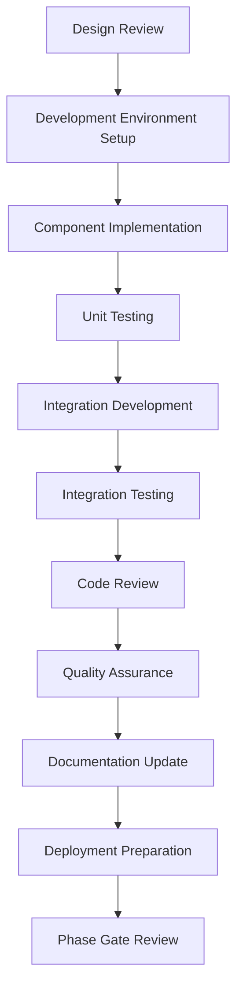

# ⚙️ Implementation Phase

## Overview

The Implementation Phase transforms detailed designs into functional software through coding, testing, and integration. This phase focuses on writing high-quality code, implementing features, conducting thorough testing, and preparing the system for deployment.

## 🎯 Objectives

- **Code Development**: Write clean, maintainable, and efficient code
- **Feature Implementation**: Implement all designed features and components
- **Unit Testing**: Create comprehensive unit tests for all components
- **Integration Testing**: Ensure components work together correctly
- **Code Quality**: Maintain high code quality standards throughout development

## 🔄 Process Flow



## 📋 Key Activities

### 1. Development Setup
- **Environment Configuration**: Set up development environments
- **Tool Installation**: Install and configure development tools
- **Repository Setup**: Configure version control and branching strategy
- **CI/CD Pipeline**: Set up continuous integration and deployment
- **Coding Standards**: Establish and communicate coding standards

### 2. Component Implementation
- **Code Development**: Write code according to design specifications
- **Design Patterns**: Implement approved design patterns
- **Error Handling**: Implement comprehensive error handling
- **Logging**: Implement appropriate logging mechanisms
- **Security Controls**: Implement security measures as designed

### 3. Testing Implementation
- **Unit Testing**: Write unit tests for all components
- **Integration Testing**: Create integration tests for component interactions
- **Test Data**: Prepare test data and test environments
- **Test Automation**: Implement automated testing workflows
- **Performance Testing**: Implement performance test scenarios

### 4. Code Quality Assurance
- **Code Reviews**: Conduct peer code reviews
- **Static Analysis**: Run static code analysis tools
- **Security Scanning**: Perform security vulnerability scans
- **Performance Analysis**: Analyze code performance characteristics
- **Documentation**: Maintain code documentation and comments

## 📊 Deliverables

| Deliverable | Description | Format |
|-------------|-------------|--------|
| **Source Code** | Complete implementation of all components | Code Repository |
| **Unit Test Suite** | Comprehensive unit tests | Test Files |
| **Integration Tests** | Integration test scenarios | Test Files |
| **Code Documentation** | Inline and API documentation | Code Comments/Docs |
| **Test Reports** | Test execution results and coverage | Reports |
| **Performance Metrics** | Performance benchmark results | Reports |
| **Security Scan Results** | Security vulnerability analysis | Reports |

## 💻 Development Practices

### 1. Coding Standards
- **Style Guidelines**: Consistent code formatting and naming
- **Best Practices**: Industry-standard coding practices
- **Design Principles**: SOLID principles and clean code practices
- **Documentation Standards**: Consistent documentation practices
- **Version Control**: Proper branching and commit practices

### 2. Testing Strategies
- **Test-Driven Development (TDD)**: Write tests before code
- **Behavior-Driven Development (BDD)**: Focus on behavior specifications
- **Test Coverage**: Maintain high test coverage percentages
- **Test Automation**: Automate as many tests as possible
- **Continuous Testing**: Integrate testing into CI/CD pipeline

### 3. Quality Assurance
- **Code Reviews**: Peer review process and checklists
- **Static Analysis**: Automated code quality checks
- **Dynamic Analysis**: Runtime behavior analysis
- **Security Testing**: Security vulnerability assessment
- **Performance Testing**: Load and stress testing

### 4. Collaboration Practices
- **Agile Methodology**: Iterative development approach
- **Daily Standups**: Regular team synchronization
- **Sprint Planning**: Iteration planning and task allocation
- **Retrospectives**: Process improvement sessions
- **Knowledge Sharing**: Technical documentation and presentations

## 🔍 AI Enhancement

### AI-Powered Development Tools
- **Code Generation**: AI-assisted code generation and completion
- **Code Review**: AI-powered code review and analysis
- **Test Generation**: Automated test case generation
- **Bug Detection**: AI-driven bug prediction and detection
- **Code Refactoring**: AI-assisted code optimization

### AI Workflows
```yaml
# AI Development Assistance Workflow
name: AI Development Assistance
on:
  push:
    branches: [ main, develop ]
  pull_request:
    branches: [ main ]

jobs:
  ai-code-analysis:
    runs-on: ubuntu-latest
    steps:
      - name: Code Quality Analysis
        uses: ai/code-quality-analyzer@v1
        with:
          source-path: 'src/'
          
      - name: Security Vulnerability Scan
        uses: ai/security-scanner@v1
        
      - name: Performance Analysis
        uses: ai/performance-analyzer@v1
        
      - name: Test Coverage Analysis
        uses: ai/test-coverage-analyzer@v1
        
      - name: Code Refactoring Suggestions
        uses: ai/refactoring-advisor@v1
        
      - name: Generate Documentation
        uses: ai/doc-generator@v1
```

## 🛠️ Development Tools and Technologies

### 1. Integrated Development Environments (IDEs)
- **Visual Studio Code**: Lightweight, extensible editor
- **IntelliJ IDEA**: Full-featured Java IDE
- **PyCharm**: Python-specific IDE
- **Eclipse**: Open-source Java IDE
- **WebStorm**: JavaScript IDE

### 2. Version Control Systems
- **Git**: Distributed version control
- **GitHub**: Git repository hosting with collaboration features
- **GitLab**: Git repository management with CI/CD
- **Bitbucket**: Git repository hosting with integrations
- **SourceTree**: Git GUI client

### 3. Testing Frameworks
- **JUnit**: Java unit testing framework
- **pytest**: Python testing framework
- **Jest**: JavaScript testing framework
- **Selenium**: Web application testing
- **Cypress**: End-to-end testing framework

### 4. Build and Deployment Tools
- **Maven**: Java build automation
- **Gradle**: Build automation for multiple languages
- **npm**: Node.js package manager and build tool
- **Docker**: Containerization platform
- **Kubernetes**: Container orchestration

## 📝 Implementation Guidelines

### Code Development Checklist
```markdown
# Code Implementation Checklist

## Pre-Implementation
- [ ] Design specifications reviewed and understood
- [ ] Development environment configured
- [ ] Dependencies identified and available
- [ ] Test cases planned and documented
- [ ] Coding standards reviewed

## During Implementation
- [ ] Code follows established patterns and principles
- [ ] Error handling implemented appropriately
- [ ] Logging added for debugging and monitoring
- [ ] Security controls implemented as designed
- [ ] Performance considerations addressed

## Post-Implementation
- [ ] Unit tests written and passing
- [ ] Code documentation completed
- [ ] Code reviewed by peers
- [ ] Static analysis issues resolved
- [ ] Integration tests updated if needed
```

### Testing Strategy Template
```markdown
# Testing Strategy: [Component/Feature Name]

## Unit Testing
### Test Coverage Goals
- Code Coverage: > 90%
- Branch Coverage: > 85%
- Function Coverage: 100%

### Test Cases
- [ ] [Test case 1 description]
- [ ] [Test case 2 description]

### Test Data
- Positive test cases
- Negative test cases
- Edge cases
- Boundary conditions

## Integration Testing
### Scenarios
- [ ] [Integration scenario 1]
- [ ] [Integration scenario 2]

### Dependencies
- External services to mock
- Database requirements
- API integrations

## Performance Testing
### Metrics
- Response time requirements
- Throughput requirements
- Memory usage limits

### Test Scenarios
- Load testing scenarios
- Stress testing scenarios
- Scalability testing
```

### Code Review Template
```markdown
# Code Review: [PR Title]

## Review Checklist

### Functionality
- [ ] Code implements requirements correctly
- [ ] Edge cases are handled
- [ ] Error handling is appropriate
- [ ] Business logic is correct

### Code Quality
- [ ] Code follows coding standards
- [ ] Code is readable and maintainable
- [ ] Design patterns are used correctly
- [ ] Code is properly modularized

### Testing
- [ ] Unit tests are comprehensive
- [ ] Test cases cover all scenarios
- [ ] Tests are well-written and maintainable
- [ ] Test coverage is adequate

### Security
- [ ] Input validation is implemented
- [ ] Authentication/authorization is correct
- [ ] Sensitive data is handled properly
- [ ] Security vulnerabilities are addressed

### Performance
- [ ] Algorithm efficiency is optimized
- [ ] Database queries are optimized
- [ ] Memory usage is appropriate
- [ ] Caching is used where beneficial

## Review Summary
### Approved
- [ ] LGTM (Looks Good To Me)
- [ ] Approved with minor suggestions
- [ ] Requires changes

### Feedback
[Provide specific feedback and suggestions]
```

## 🎯 Quality Metrics

### Code Quality Metrics
- **Code Coverage**: Percentage of code covered by tests
- **Cyclomatic Complexity**: Measure of code complexity
- **Code Duplication**: Percentage of duplicated code
- **Maintainability Index**: Overall code maintainability score
- **Technical Debt**: Estimated effort to fix code issues

### Performance Metrics
- **Response Time**: Time to process requests
- **Throughput**: Number of requests processed per second
- **Resource Usage**: CPU, memory, and disk usage
- **Scalability**: Ability to handle increased load
- **Efficiency**: Resource utilization efficiency

### Security Metrics
- **Vulnerability Count**: Number of security vulnerabilities
- **Security Score**: Overall security assessment
- **Compliance Score**: Adherence to security standards
- **Risk Assessment**: Security risk level
- **Remediation Time**: Time to fix security issues

## 🚀 Phase Exit Criteria

The Implementation Phase is complete when:

1. ✅ **All Features Implemented**: All designed features are coded and functional
2. ✅ **Unit Tests Complete**: Comprehensive unit tests are written and passing
3. ✅ **Integration Tests Pass**: Integration tests validate component interactions
4. ✅ **Code Reviews Completed**: All code has been peer-reviewed and approved
5. ✅ **Quality Gates Passed**: Code quality metrics meet standards
6. ✅ **Security Scans Clear**: No critical security vulnerabilities
7. ✅ **Performance Benchmarks Met**: Performance requirements are satisfied
8. ✅ **Documentation Updated**: Code documentation is complete and current
9. ✅ **Phase Gate Passed**: Formal approval from governance committee

## 📚 Related Resources

- [Design Phase](../design/README.md)
- [Testing Guidelines](../guidelines/testing.md)
- [Code Review Best Practices](../guidelines/code-review.md)
- [Security Development Guidelines](../guidelines/secure-coding.md)
- [Performance Optimization Guide](../guidelines/performance.md)

---

*Generated by AI SDLC Framework on 2025-12-18T17:54:00.000Z*
