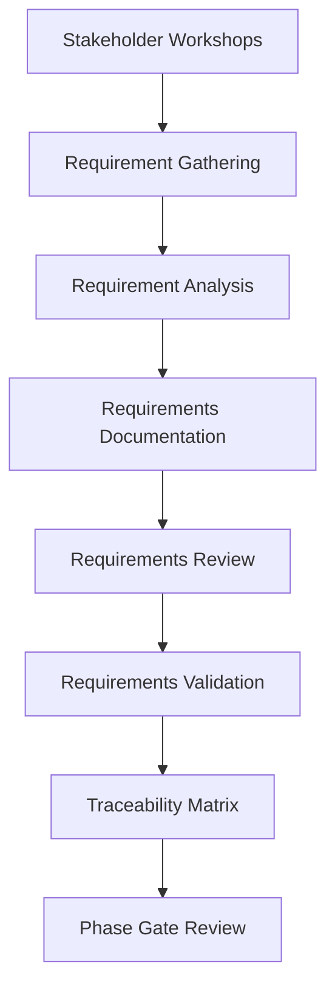

# 📋 Requirements Phase

## Overview

The Requirements Phase transforms validated concepts into detailed, actionable requirements that guide the entire development process. This phase focuses on capturing, analyzing, documenting, and validating both functional and non-functional requirements.

## 🎯 Objectives

- **Requirement Elicitation**: Gather comprehensive requirements from all stakeholders
- **Requirement Analysis**: Analyze, prioritize, and categorize requirements
- **Documentation**: Create detailed requirement specifications
- **Validation**: Ensure requirements meet stakeholder needs
- **Traceability**: Establish requirement traceability matrices

## 🔄 Process Flow



## 📋 Key Activities

### 1. Stakeholder Requirements Gathering
- **User Stories**: Capture user-centric requirements
- **Functional Requirements**: System behaviors and features
- **Non-Functional Requirements**: Performance, security, usability
- **Business Rules**: Business logic and constraints
- **Regulatory Requirements**: Compliance and legal requirements

### 2. Requirements Analysis
- **Requirements Classification**: Categorize by type and priority
- **Conflict Resolution**: Identify and resolve conflicting requirements
- **Feasibility Assessment**: Technical and business feasibility
- **Risk Analysis**: Identify requirement-related risks
- **Impact Analysis**: Assess impact on existing systems

### 3. Requirements Documentation
- **Software Requirements Specification (SRS)**: Comprehensive requirements document
- **User Interface Specifications**: UI/UX requirements
- **System Interface Specifications**: Integration requirements
- **Data Requirements**: Data models and relationships
- **Performance Requirements**: Performance benchmarks and SLAs

### 4. Requirements Validation
- **Requirements Review Sessions**: Stakeholder review and approval
- **Prototype Validation**: Validate requirements through prototypes
- **Acceptance Criteria Definition**: Define completion criteria
- **Test Case Development**: Create test cases from requirements
- **Sign-off Process**: Formal approval process

## 📊 Deliverables

| Deliverable | Description | Format |
|-------------|-------------|--------|
| **Business Requirements Document (BRD)** | High-level business requirements | PDF/Markdown |
| **Software Requirements Specification (SRS)** | Detailed technical requirements | PDF/Markdown |
| **User Stories** | Agile requirement format | Markdown/JIRA |
| **Requirements Traceability Matrix** | Requirement tracking | Spreadsheet |
| **Acceptance Criteria** | Definition of done | Markdown |
| **Interface Specifications** | System integration requirements | PDF/Markdown |

## 🎯 Requirement Categories

### Functional Requirements
- **User Authentication**: Login, registration, password management
- **Data Management**: CRUD operations, data validation
- **Business Logic**: Core business processes and rules
- **Reporting**: Reports, analytics, dashboards
- **Integration**: Third-party system integrations

### Non-Functional Requirements
- **Performance**: Response time, throughput, scalability
- **Security**: Authentication, authorization, data protection
- **Usability**: User experience, accessibility, learning curve
- **Reliability**: Availability, error handling, recovery
- **Maintainability**: Code quality, documentation, modularity

### Technical Requirements
- **Platform Requirements**: Operating systems, browsers, devices
- **Database Requirements**: Database systems, capacity, performance
- **Network Requirements**: Bandwidth, latency, protocols
- **Scalability Requirements**: Load balancing, clustering
- **Monitoring Requirements**: Logging, metrics, alerting

## 🔍 AI Enhancement

### AI-Powered Requirements Tools
- **Requirements Extraction**: AI-driven requirement extraction from documents
- **Requirements Analysis**: Automated requirement quality analysis
- **Requirements Prediction**: AI-powered requirement completeness checking
- **Requirements Impact Analysis**: Automated change impact assessment

### AI Workflows
```yaml
# AI Requirements Analysis Workflow
name: AI Requirements Analysis
on:
  pull_request:
    paths:
      - 'docs/requirements/**'

jobs:
  requirements-analysis:
    runs-on: ubuntu-latest
    steps:
      - name: Analyze Requirements Quality
        uses: ai/requirements-analyzer@v1
        with:
          requirements-path: 'docs/requirements/'
          
      - name: Check Requirement Completeness
        uses: ai/requirement-completeness@v1
        
      - name: Generate Traceability Matrix
        uses: ai/traceability-generator@v1
        
      - name: Identify Requirement Conflicts
        uses: ai/conflict-detector@v1
```

## 📝 Templates

### User Story Template
```markdown
# User Story: [Title]

## As a [user type]
I want [functionality]
So that [benefit/value]

## Acceptance Criteria
- [ ] Given [context] When [action] Then [expected result]
- [ ] Given [context] When [action] Then [expected result]

## Requirements ID
REQ-XXX

## Priority
[High/Medium/Low]

## Dependencies
[List of dependent requirements]

## Notes
[Additional context or constraints]
```

### Functional Requirement Template
```markdown
# Functional Requirement: [ID]

## Requirement Description
[Detailed description of the requirement]

## Rationale
[Why this requirement is needed]

## Acceptance Criteria
- [ ] [Specific criteria 1]
- [ ] [Specific criteria 2]

## Priority
[Must have/Should have/Could have/Won't have]

## Source
[Stakeholder or document source]

## Dependencies
[List of dependent requirements]

## Verification Method
[How the requirement will be tested/verified]
```

### Non-Functional Requirement Template
```markdown
# Non-Functional Requirement: [ID]

## Requirement Type
[Performance/Security/Usability/Reliability/Maintainability]

## Requirement Description
[Detailed description of the non-functional requirement]

## Metric
[Specific measurable criteria]

## Target Value
[Quantitative target]

## Measurement Method
[How the metric will be measured]

## Priority
[High/Medium/Low]

## Rationale
[Why this requirement is important]
```

## 📊 Requirements Quality Attributes

### Complete Requirements
- All user needs are captured
- All business rules are documented
- All constraints are identified
- All interfaces are specified

### Correct Requirements
- Requirements accurately reflect user needs
- Requirements are technically feasible
- Requirements are consistent with business goals
- Requirements are free from ambiguity

### Clear Requirements
- Requirements are unambiguous
- Requirements are easily understood
- Requirements use consistent terminology
- Requirements are properly formatted

### Verifiable Requirements
- Each requirement has acceptance criteria
- Requirements can be tested objectively
- Requirements have specific measurable outcomes
- Requirements have clear pass/fail criteria

## 🚀 Phase Exit Criteria

The Requirements Phase is complete when:

1. ✅ **Requirements Documented**: All requirements are formally documented
2. ✅ **Requirements Validated**: Stakeholders have reviewed and approved requirements
3. ✅ **Traceability Established**: Requirements traceability matrix is complete
4. ✅ **Test Cases Created**: Test cases are developed for all requirements
5. ✅ **Phase Gate Passed**: Formal approval from governance committee
6. ✅ **Baseline Established**: Requirements are baselined for change management

## 📚 Related Resources

- [Architecture Phase](../architecture/README.md)
- [Design Phase](../design/README.md)
- [Requirements Management Guidelines](../guidelines/requirements-management.md)
- [User Story Best Practices](../guidelines/user-stories.md)

---

*Generated by AI SDLC Framework on 2025-12-18T17:51:00.000Z*
